# Tutorial Install Almalinux V9.3 melalui virtualbox

## Penjelasan AlmaLinux 

Sebelum memasuki penginstallan saya akan menjelaskan AlmaLinux terlebih dahulu.
AlmaLinux merupakan sistem operasi open source berbasis Linux yang kompatibel dengan Red Hat Enterprise Linux (RHEL). AlmaLinux dikembangkan oleh perusahaan CloudLinux menggunakan kode sumber RHEL.
AlmaLinux adalah proyek dari RedHat yang dikembangkan sebagai alternatif dari sistem operasi CentOS. Proyek AlmaLinux dimulai setelah RedHat mengumumkan bahwa mereka akan mengalihkan fokus dan waktu mereka dari CentOS Linux ke CentOS Stream.

## Menjalankan instalasi Almalinux V9.3

#### 1. Pada virtualbox kalian pilih `new`, lalu muncul `Create Virtual Machine` silahkan diisi sesuai pada gambar dibawah ini, jangan lupa pada `ISO Image` di pilih file AlmaLinux yang telah kalian download, lalu `next`.
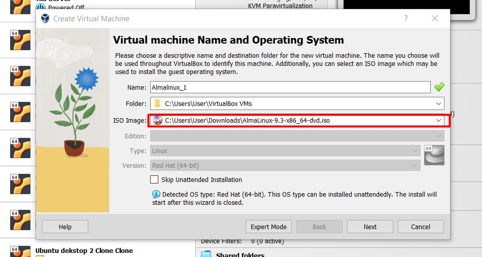

#### 2. Jika sudah di `next`, perhatikan pada `Username` dan `Hostname` jika sudah tercentang maka sudah bisa di `next`.
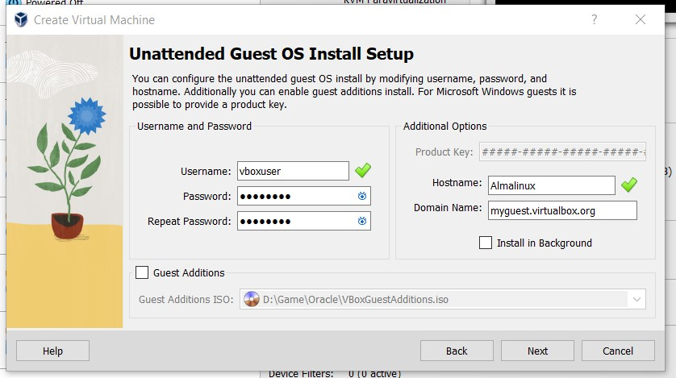

#### 3. Pada tampilan `Hardware` di bagian `Base Memory` kalian atur sampai `4096 MB`, lalu di `next`.
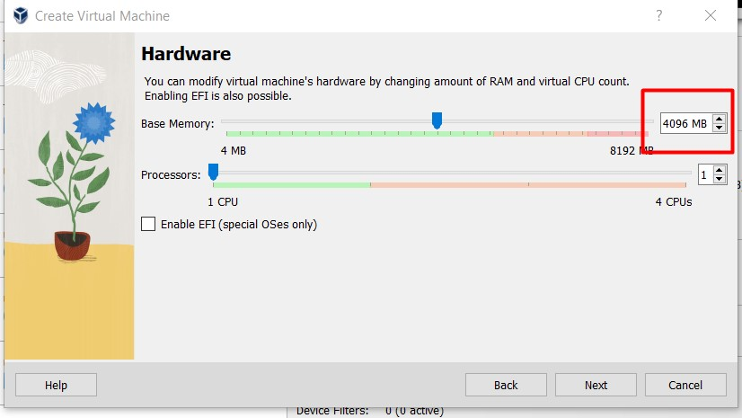

#### 4. Pada tampilan `Virtual Hard disk` silahkan diatur sebebasnya, tapi disini saya atur sampai `40.00 GB` untuk meringankan memory, jika sudah lalu di `next`.
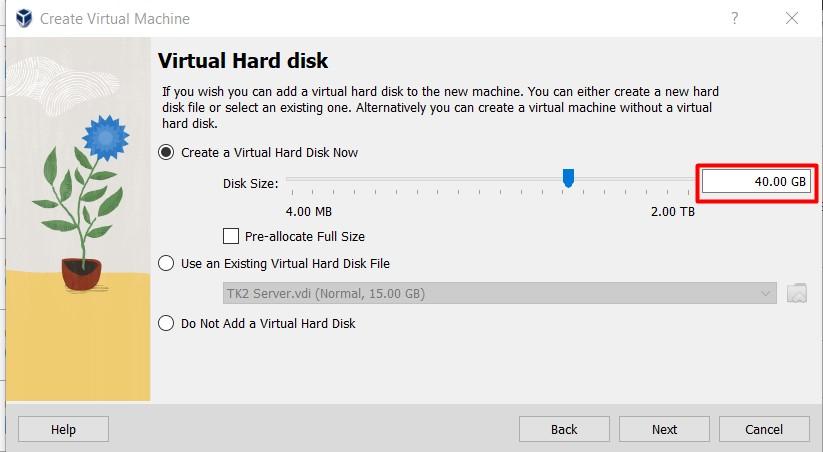

#### 5. Jika sudah semua maka akan menampilkan `Summary`, lalu tekan `Finish`.
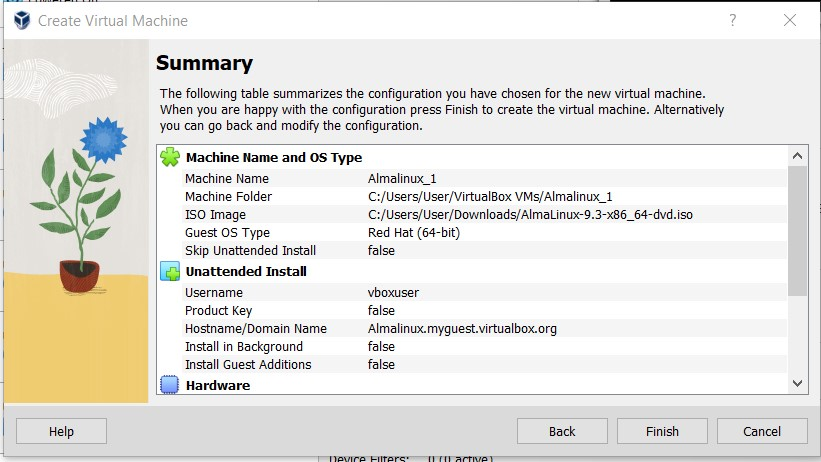

#### 6. Pada tampilan awal virtualbox kalian tekan `Start`, lalu akan menampilkan seperti pada gambar dibawah ini, pada `DVD` kalian pilih file ISO yang telah kalian download dan `Mount and Retry Boot`.
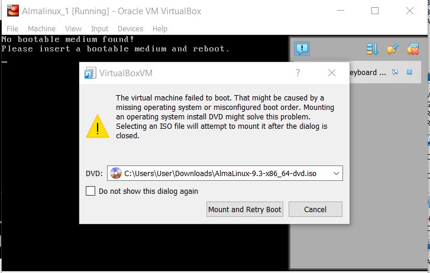

#### 7. Lalu pilih `Install AlmaLinux 9.3` dan tekan enter.
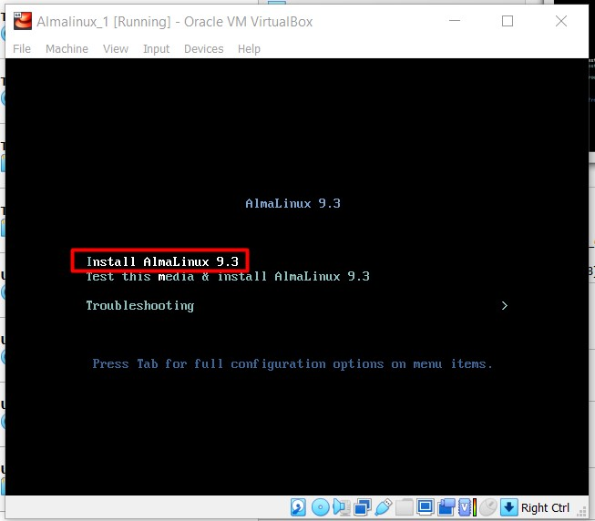

#### 8. Pilih tampilan bahasa untuk Almalinux kalian, lalu tekan `Lanjutkan`.
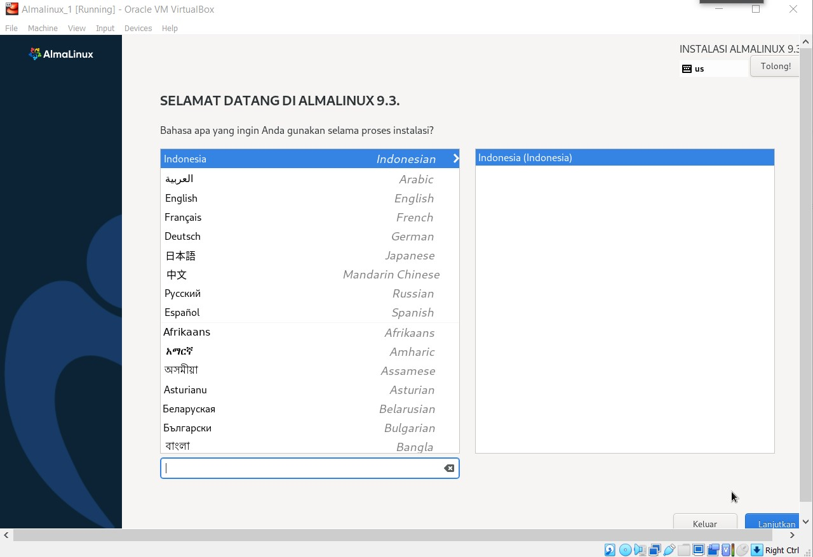

#### 9. Lalu kalian atur pada `Tujuan Instalasi, Kata Sandi Root, dan Pembuatan Pengguna`.
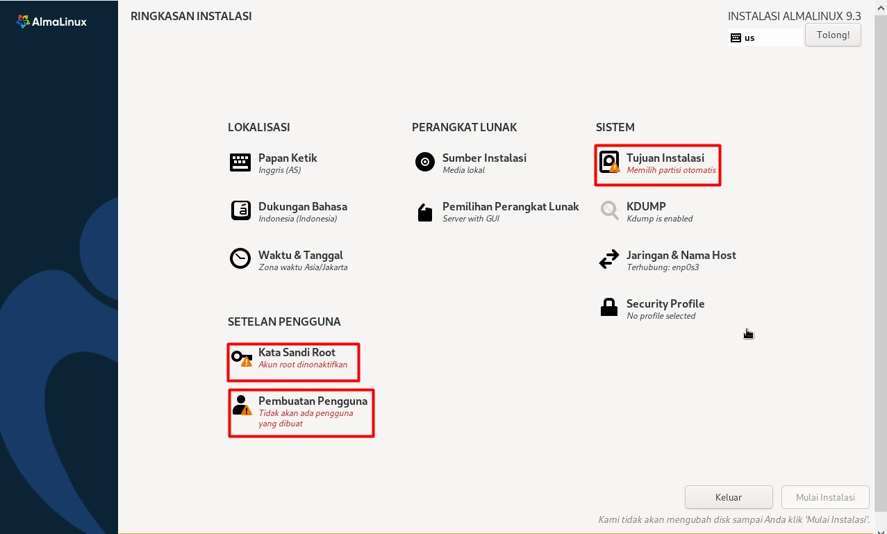

#### 10. Pada `Tujuan Instalasi` kalian pilih `ATA VBOX HARDDISK` seperti pada tampilan dibawah ini, lalu tekan `Selesai`.
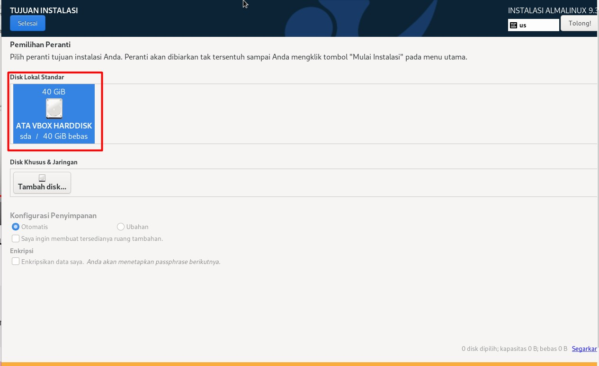

#### 11. Pada `Sandi Root` kalian atur sandi kalian, lalu tekan `Selesai`.
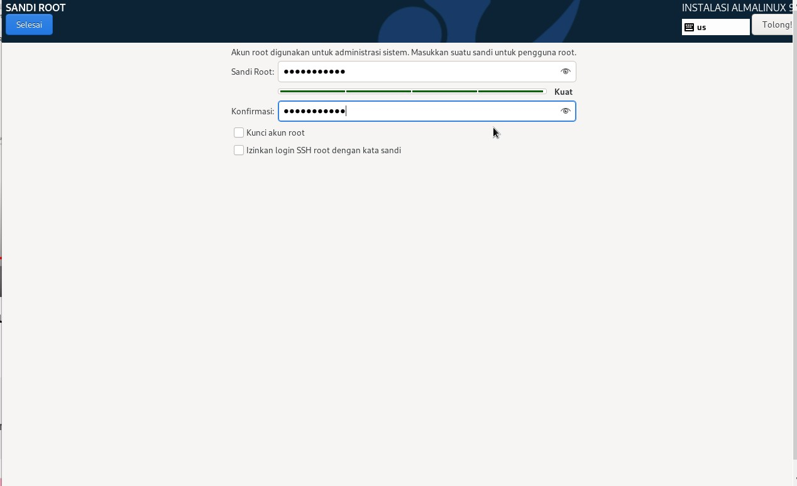

#### 12. Pada `Pembuatan Pengguna` kalian isi sesuai nama dan sandi kalian, lalu tekan `Selesai`.
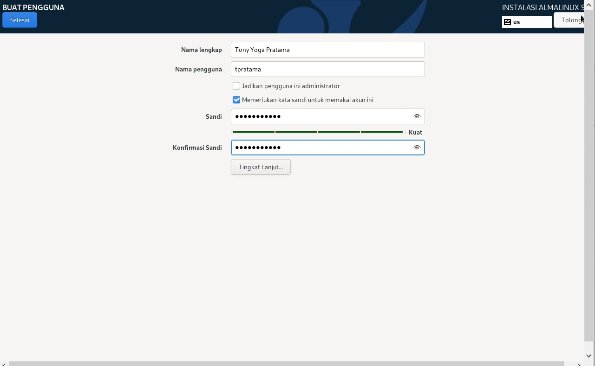

#### 13. Jika semua persyaratan sudah diisi semua, maka tampilannya akan sama seperti gambar dibawah ini, lalu tekan `Mulai Instalasi`. Jika belum berhasil atau masih ada yang gagal maka bisa diatur lagi dibagian yang bermasalah sampai berhasil.
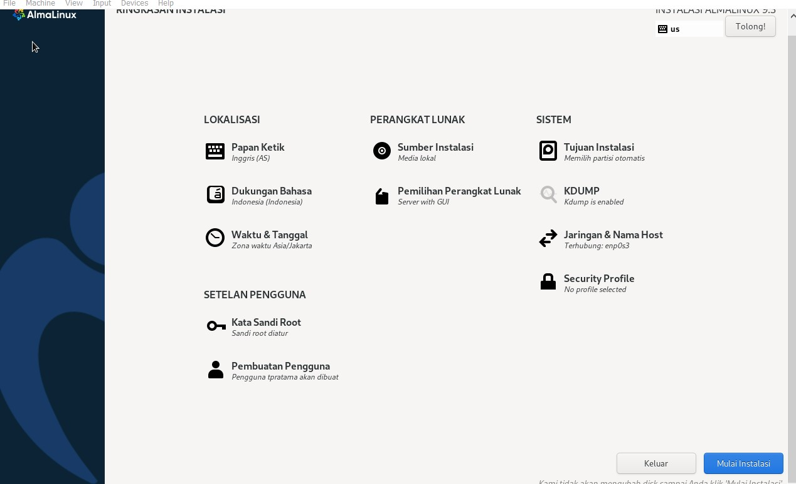

#### 14. Lalu tunggu penginstallan sampai keluar tombol `Boot Ulang Sistem`.
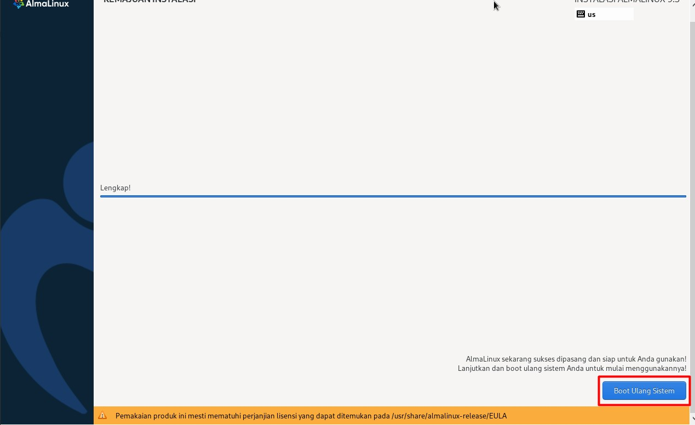

#### 15. Jika berhasil maka keluar tampilan seperti gambar dibawah ini, tekan `profil dan masukkan sandi` yang telah dibuat tadi.
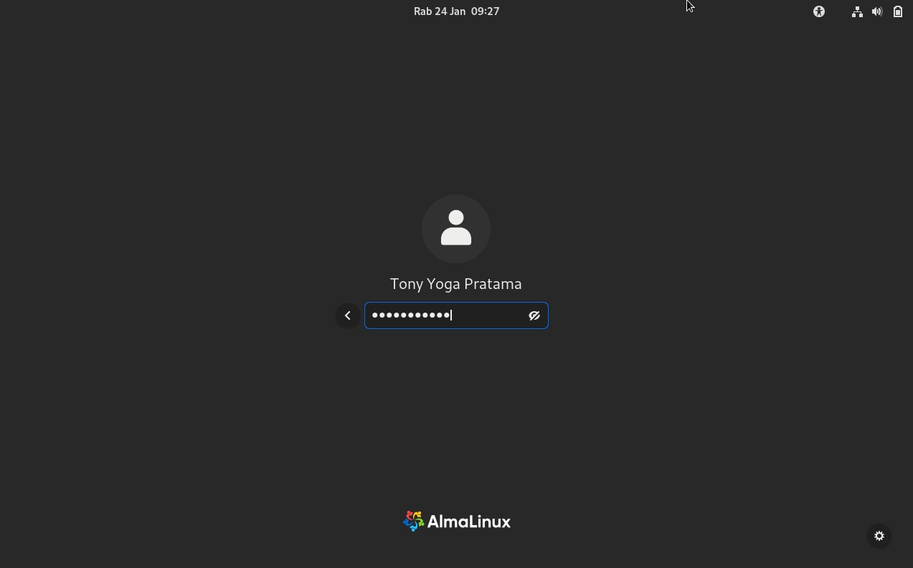

#### 16. Selamat anda telah berhasil menginstall AlmaLinux di virtualbox
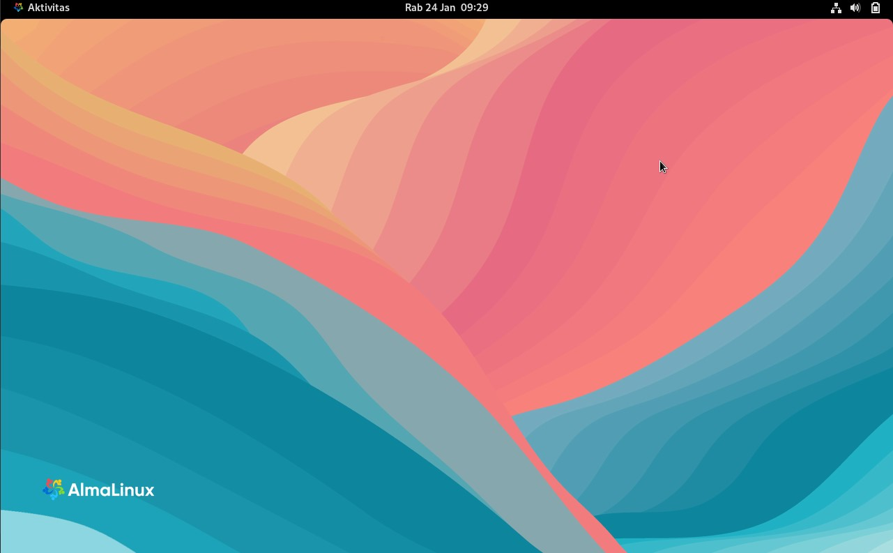
